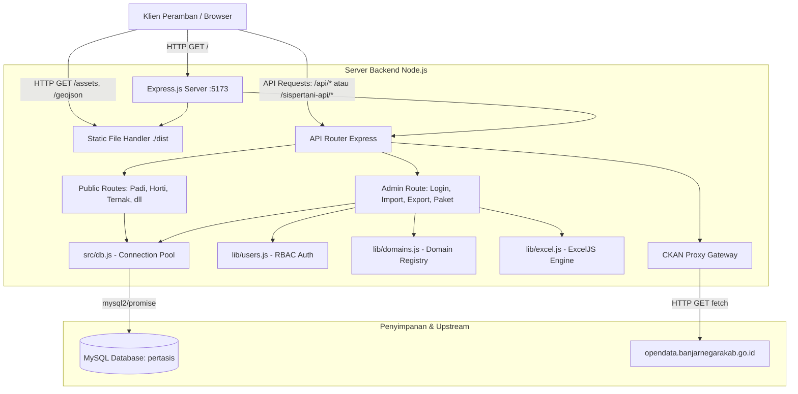
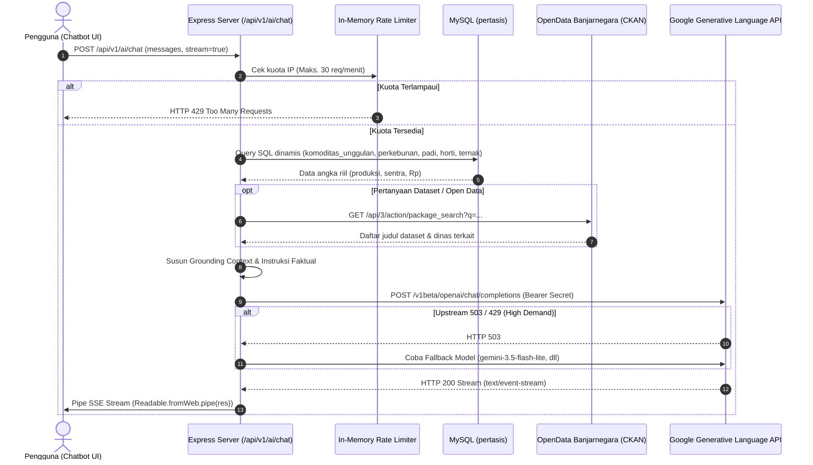

# Arsitektur Sistem SISPERTANI

Dokumen ini menjelaskan arsitektur perangkat lunak, aliran data makro, pola integrasi, dan batasan teknis sistem SISPERTANI Kabupaten Banjarnegara.

---

## 1. Diagram Aliran Data Makro

Sistem mengadopsi pola **Single-Unit Monolith (Micro-Monolith)** di mana server Node.js Express melayani API RESTful berorientasi data statistik dan sekaligus menyajikan antarmuka pengguna SPA (Single Page Application) serta berkas spasial GeoJSON statis:

---

## 2. Lapisan Presentasi & Frontend (Presentation Layer)

1. **Aplikasi Single-Page (SPA):**
   - Dibangun dengan Vite, React, dan Tailwind/CSS modern.
   - Dikompilasi ke direktori `./dist` dan disajikan langsung oleh Express melalui middleware `express.static(distRoot)`.
   - **SPA Fallback Routing:** Seluruh permintaan `GET` tanpa ekstensi berkas yang bukan merupakan rute `/api` atau `/sispertani-api` dialihkan secara otomatis ke `./dist/index.html`. Hal ini memastikan fitur reload/refresh halaman pada rute dalam (seperti `/desa/:kecamatan/:desa` atau `/bidang/:nama`) tetap berjalan tanpa galat 404.

2. **Lapisan Spasial GIS (Geographic Information System):**
   - Menggunakan pustaka MapLibre GL untuk merender peta interaktif.
   - Peta dan data vektor disajikan dalam format GeoJSON statis dari direktori `./dist/` (`peta_desa_v3.geojson`, `peta_kecamatan.geojson`, `sawah.geojson`, `kebun.geojson`, `ladang.geojson`, `danau.geojson`, `sungai.geojson`, `jalan.geojson`, dll).

3. **Arsitektur Aset Bersih & Layout Normalisasi Header:**
   - Direktori `./dist/assets` dikelola secara bersih (*deterministic asset pruning*) hanya menyisakan berkas aktif terverifikasi (106 berkas terhubung ke entry point `index-C7-MA-gB.js` dan CSS `index-CSp9XjIe.css`), mengeliminasi 2.714 berkas artefak build usang dan 22 file CSS mati.
   - Tata letak antarmuka utama (`default-PIMY9oy9.js` / `pages-COv__DbI.js`) mengimplementasikan **Avatar Dropdown Interaktif** setinggi `72px`, merapikan tautan utilitas (Info, Panduan, Akses Portal Admin, dan Profil Akses) ke dalam wadah floating menu terpadu.

---

## 3. Lapisan Logika & Kontrol (Logic Layer)

1. **Dual-Mount Route Pattern:**
   - Untuk memfasilitasi penggunaan frontend baik secara langsung melalui port tunggal maupun di belakang reverse-proxy (seperti Nginx atau CloudPanel), seluruh endpoint API didaftarkan pada satu Express Router dan di-mount dua kali:
     - `/api/*` (jalur internal standar)
     - `/sispertani-api/*` (jalur prefix yang dipanggil frontend)
   - Pendekatan ini menghilangkan kerapuhan penulisan ulang URL (`req.url rewrite`) di middleware antar-versi Express.

2. **Manajemen Domain & Upsert Otomatis (Dynamic Domain Registry):**
   - Pustaka [`src/lib/domains.js`](file:///e:/Project/pertanian_main/src/lib/domains.js) mendaftarkan metadata **17 domain pertanian operasional** (mencakup KWT, LTT & Katam, dan 11 sheet Perikanan dengan dropdown validasi).
   - **Prinsip Single Source of Truth & Anti-Over-Engineering (ADR-009):** Komoditas Unggulan bukanlah berkas yang di-upload terpisah oleh dinas, melainkan dikalkulasi secara otomatis oleh server dari data produksi primer lapangan (padi, palawija, hortikultura, perkebunan, peternakan, 10 jenis ikan). Form upload `komoditas-unggulan` ditiadakan dari Admin Dasbor untuk mengeliminasi beban input ganda dan memastikan konsistensi angka 100%.
   - Kolom untuk template Excel dibaca secara dinamis dari `information_schema.columns` MySQL saat runtime, menjamin template Excel selalu sinkron 100% dengan skema database tanpa perlu migrasi kode ganda.
   - Menggunakan *natural key* unik per sheet (misal: kombinasi `kecamatan`, `tahun`, `komoditas`) untuk melakukan operasi `INSERT ... ON DUPLICATE KEY UPDATE` saat proses impor Excel berlangsung. Ekspor data menyertakan kolom `Sumber Data` untuk keterlacakan audit (*traceability*).

3. **Gateway Asisten AI & Live RAG Engine:**
   - Modul [`src/routes/ai.js`](file:///e:/Project/pertanian_main/src/routes/ai.js) melayani Chatbot Si Pertani secara aman dari server-side, mengisolasi token `GEMINI_API_KEY` dari klien.
   - Dilengkapi **In-Memory Sliding Rate Limiter** (30 request/menit), **Multi-Model Fallback** (`gemini-flash-lite-latest`, `gemini-3.5-flash-lite`, `gemini-3.6-flash`, `gemini-3.8-flash`), dan **Dynamic RAG** yang menarik data riil basis data `pertasis` dan portal CKAN secara instan.

4. **Autentikasi & RBAC (Role-Based Access Control):**
   - Modul [`src/lib/users.js`](file:///e:/Project/pertanian_main/src/lib/users.js) membatasi akses berdasarkan bidang teknis (Tanaman Pangan, Hortikultura & Perkebunan, Peternakan, Perikanan, dan Administrator Pusat).
   - Menggunakan in-memory Bearer token dengan masa kedaluwarsa 12 jam.
   - Keamanan login diperkuat dengan `crypto.timingSafeEqual` untuk mencegah serangan *timing attack* dan pembatasan laju (rate limiting) maksimal 5 kali kegagalan per 15 menit per alamat IP.

5. **Proksi CKAN Gateway:**
   - Menyediakan endpoint `/api/3/*` yang meneruskan kueri ke portal Open Data resmi Kabupaten Banjarnegara (`https://opendata.banjarnegarakab.go.id`).
   - Menyediakan header cache `public, max-age=300` untuk mengurangi beban upstream dan memastikan katalog dataset tetap dapat diakses dari origin aplikasi yang sama tanpa kendala CORS.

---

## 4. Lapisan Basis Data (Persistence Layer)

- Menggunakan **MySQL/MariaDB** dengan nama database `pertasis`.
- Koneksi diatur menggunakan pool lazy-loaded pada [`src/db.js`](file:///e:/Project/pertanian_main/src/db.js) dengan `connectionLimit: 10`.
- Opsi `decimalNumbers: true` diaktifkan untuk memastikan nilai numerik presisi (seperti tonase panen dan persentase luas) dikembalikan dalam format tipe data `number` JavaScript asli, bukan `string`, menjaga integritas JSON dan grafik frontend.
- Opsi `dateStrings: true` mencegah pergeseran zona waktu yang tidak diinginkan pada format tanggal laporan.

---

## 5. Arsitektur Analitik Sektor & Zero Dummy Data

1. **Agregasi Dinamis Berbasis Waktu & Sektor:**
   - Endpoint `GET /api/v1/ekonomi/sektor-ringkasan` dan `GET /api/v1/komoditas-unggulan` menghitung ranking komoditas utama (ranking #1 volume panen) dan estimasi valuasi ekonomi secara langsung dari tabel basis data MySQL (`komoditas_unggulan` dan `nilai_ekonomi_tahunan`).
   - Setiap bidang (Tanaman Pangan, Hortikultura, Perkebunan, Peternakan, Perikanan) memiliki partisi data independen yang mencerminkan hasil input dinamis admin Sistertan dan sinkronisasi Open Data.

2. **Kepatuhan Zero Dummy Data (Zero Dummy Data Law):**
   - Sistem dirancang **tanpa data tiruan fiktif**:
     - Komoditas dengan volume produksi `0` otomatis dikecualikan dari pemeringkatan unggulan dan kalkulasi ekonomi.
     - Tahun yang belum memiliki catatan produksi mengembalikan status `empty` dan `totalNilaiEkonomiRp: 0` transparan.
     - Klien merender kartu status netral yang ramah pengguna alih-alih menampilkan varietas atau angka buatan.

3. **Integrasi Komponen & Submenu Navigasi Ganda:**
   - **Tingkat Halaman Sektor:** Widget `SectorEconomicWidget` tertanam reaktif pada 5 halaman produksi utama (`/food-crops`, `/horticulture`, `/plantation`, `/livestock`, `/fisheries`) mengikuti filter tahun aktif.
   - **Tingkat Navigasi Sidebar:** Setiap bidang dilengkapi 2 submenu mandiri:
     - `Komoditas Unggulan`: rute `/komoditas-unggulan/:bidang` untuk rincian varietas, luas, dan sentra komoditas.
     - `Nilai Ekonomi`: rute `/nilai-ekonomi/:bidang` untuk analisis valuasi finansial per komoditas.

---

## 6. Arsitektur AI Gateway & Dynamic Live RAG (Si Pertani)

1. **Isolasi Kredensial Mutlak:** API Key Google Gemini (`GEMINI_API_KEY`) hanya dibaca melalui `process.env` di backend, tidak pernah terekspos di paket statis frontend bundle (`dist/assets`).
2. **Proteksi Anti-Eksploitasi:** In-memory sliding rate limiter membatasi 30 panggilan per menit per alamat IP guna mencegah pengurasan kuota token oleh pihak ketiga.
3. **Dynamic Live Grounding (Paritas Dev & Production):** Server mengekstrak kata kunci pencarian dari pengguna lalu melakukan kueri SQL langsung ke basis data `pertasis` dan katalog CKAN. Data angka riil disuntikkan ke prompt sistem sebagai fakta mutlak agar AI dilarang keras berhalusinasi atau memberikan template penolakan generik.
4. **Resilience & High Availability:** Orkestrasi fallback multi-model (`gemini-flash-lite-latest` -> `gemini-3.5-flash-lite` -> `gemini-3.6-flash` -> `gemini-3.8-flash`) menjamin layanan asisten tetap berjalan lancar tanpa terganggu lonjakan beban (*high demand*) pada model tertentu.

